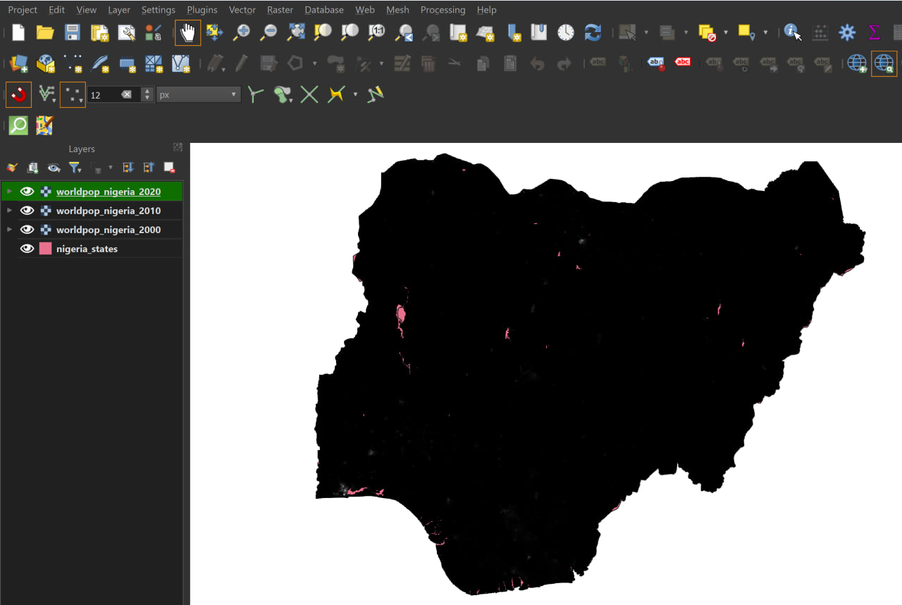
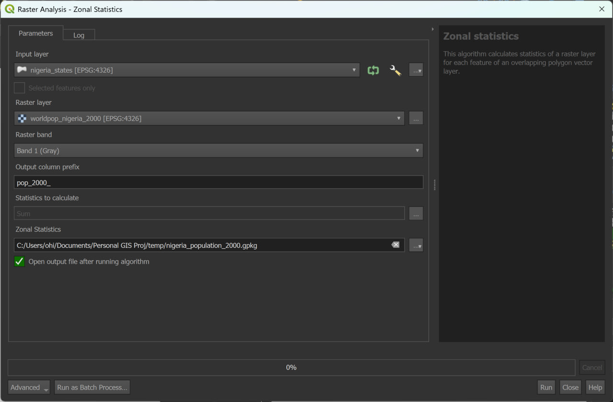
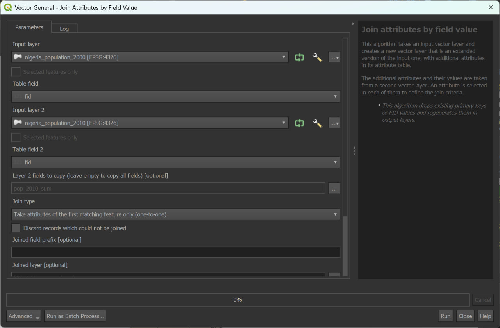
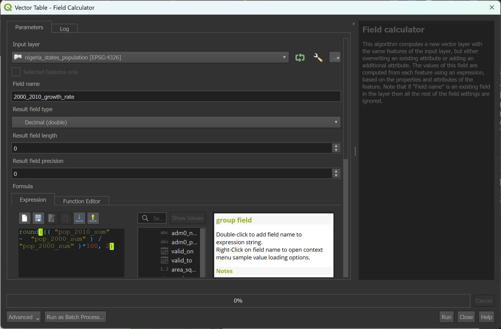
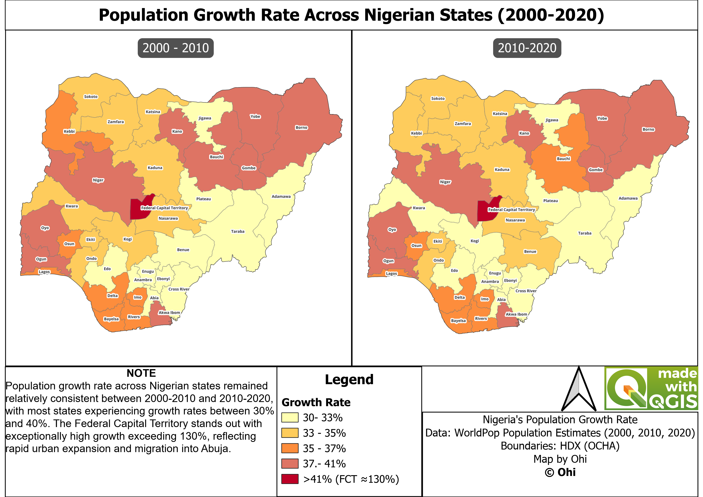

# Nigeria Population Growth Rate Analysis (2000-2020)

## 📌 Overview 
This project analyzes population growth patterns across Nigerian states between 2000 and 2020 using geospatial techniques in QGIS. 
The goal is to understand how population growth varies spatially and identify regions experiencing unusually high or low growth. 

## 🎯 Objectives
- Analyze population growth trends across Nigerian states
- Compare growth rates between 2000–2010 and 2010–2020
- Identify spatial patterns and outliers
- Provide insights into possible demographic and urbanization trends

## 🗂️ Data Sources
- **Population Data**: WorldPop (1 km resolution, 2000, 2010, 2020)  
  https://hub.worldpop.org/geodata/listing?id=74  
- **Administrative Boundaries**: HDX (OCHA) - Nigeria Admin Level 1 (States)  
  https://data.humdata.org/dataset/cod-ab-nga  

All datasets used in this project are included in the `/data` folder to ensure full reproducibility of the analysis.

## ⚙️ Methodology
### 1. Data Importation
Population raster datasets for the years 2000, 2010, and 2020 were obtained from the WorldPop database and imported into QGIS.
Additionally, Nigeria’s administrative boundary shapefile (Admin Level 1 - states) was loaded into the project.



### 2. Data Preparation
The raster layers and administrative boundary shapefile were verified to ensure they shared the same coordinate reference system (CRS).
This step is essential to guarantee accurate spatial analysis and alignment between datasets.
### 3. Zonal Statistics
Zonal statistics was performed to extract population values from the raster datasets and assign them to the corresponding state polygons in the vector layer.

Since the population data is stored in raster format (gridded cells), and the administrative boundaries are in vector format (polygons), this step allows the aggregation of raster values within each state boundary.

In this analysis, each state polygon represents a zone, and the raster cells within each zone are summarized to produce a total population value for that state.

🔧 **Tool Setup**

Input Layer (Zone Layer):
Nigeria state boundaries (vector layer)
→ This defines the zones over which statistics are calculated

Raster Layer:
WorldPop population raster (e.g., 2000 dataset)
→ This contains the population values to be summarized

Raster Band:
Band 1 (default population values)

Statistics Calculated:
Sum
→ This provides the total population within each state

Output Column Prefix:
pop_2000_
→ Used to label the resulting attribute fields



🔁 **Repetition for Multiple Years**

The same process was repeated for:

2010 population raster

2020 population raster

This resulted in population totals for each state across all three years.

### 4. Data Joining
After performing zonal statistics, separate layers were generated for each year (2000, 2010, and 2020), each containing population values for Nigerian states.
However, these values existed in different layers, making comparison and further analysis difficult.

To enable analysis of population change over time, it was necessary to combine all population attributes into a single layer.

🔧 **Method Used: Join Attributes by Field Value**

The “Join Attributes by Field Value” tool in QGIS was used to merge the datasets. 

This tool joins two vector layers based on a common field (key) shared between them.

⚙️ **How it was done**

**Step 1 - First Join**
- Input Layer:
Population layer (e.g., 2000)
- Input Layer 2:
Population layer (e.g., 2010)
- Join Field:
fid (common unique identifier)
- Fields Selected:
Only the required population field (e.g., pop_2010_sum)



👉 Result:
A new layer containing population data for 2000 and 2010

**Step 2 — Second Join**

The result from Step 1 was then joined with the 2020 population layer using the same method.

👉 Final result:

A single layer containing:

pop_2000_sum

pop_2010_sum

pop_2020_sum

for each Nigerian state.

### 5. Growth Rate Calculation
After combining the population values for all years into a single layer, the next step was to calculate the population growth rate for each state.

This was done using the **Field Calculator** tool in QGIS, which allows the creation of new attributes based on mathematical expressions.

⚙️ **Method Used: Field Calculator**

The Field Calculator was used to create new fields representing growth rates.

📊 **Growth Rate Formula**

The population growth rate was calculated using:

Growth Rate = ((P<sub>2</sub> - P<sub>1</sub>) / P<sub>1</sub>) × 100

Where:

P<sub>1</sub> = initial population

P<sub>2</sub> = later population

🔧 **Implementation in QGIS**

**Step 1 — Growth Rate (2000 - 2010)**

A new field was created:
2000_2010_growth_rate

Field type:
Decimal (double)

Expression used:

```round((("pop_2010_sum" - "pop_2000_sum") / "pop_2000_sum") * 100, 2)```

👉 This calculates percentage growth and rounds it to 2 decimal places.

**Step 2 — Growth Rate (2010 - 2020)**

The same process was repeated to calculate:

2010_2020_growth_rate

Using:

```round((("pop_2020_sum" - "pop_2010_sum") / "pop_2010_sum") * 100, 2)```



🔁 **Final Output of This Step**

At the end of this process, the final layer contained:

Population (2000)

Population (2010)

Population (2020)

Growth Rate (2000–2010)

Growth Rate (2010–2020)

for each Nigerian state.

### 6. Visualization
After calculating the population growth rates, the results were visualized using the Layer Styling panel in QGIS.

🎨 **Symbology and Colour Scheme**
- A graduated colour symbology was applied to the growth rate fields
- A yellow–orange–red color gradient was used to represent increasing growth rates

👉 **Interpretation of colors**:
- Yellow → lower growth rates
- Orange → moderate growth
- Red → higher growth rates

⚙️ **Classification Method**
- Growth rates were grouped into class intervals
- The same class ranges were used across both time periods to ensure consistent comparison

🌍 **Interpretation Design**
- The styling was designed to clearly highlight spatial differences in growth
- Areas with relatively higher growth appear more intense (red), making them easy to identify
- Special attention was given to outliers such as the Federal Capital Territory (FCT)

## 📊 Key Insights

- Most Nigerian states experienced moderate growth (30–40%)
- The Federal Capital Territory (FCT) showed exceptional growth (~130%)
- Growth patterns were relatively consistent across both decades
- No strong evidence of accelerated growth trends
- The South-East region generally showed slightly lower growth
- The South-West and parts of the North-East showed relatively higher growth

## 🗺️ Final Output


## 🛠️ Tools Used
- QGIS
- WorldPop Dataset
- HDX (OCHA) Boundaries

## 👤 Author
Ohi

## 📌 Notes

This analysis is based on gridded population estimates and is intended for spatial trend analysis rather than exact census values.

This analysis uses 1 km gridded population data, which provides a generalized representation of population distribution.

Population values are aggregated at the state level and may not capture intra-state variations.

WorldPop data represents modeled estimates and may differ from official census figures.

